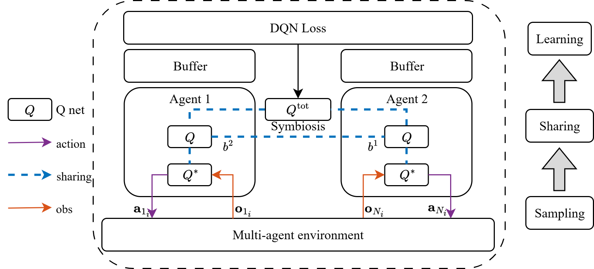

# Research
*(\*: equal contribution)*

**Please feel free to contact me if you are interested in any of the following works.**

### Journal Publications

  
  

    <h3>Optimal gait design for a soft quadruped robot via multi-fidelity Bayesian optimization</h3>
    
<strong>Authors:</strong> <a href="https://kaigetan.github.io/">Kaige Tan</a>, <strong>Xuezhi Niu</strong>, <a href="https://qinglei.tech/">Qinglei Ji</a>, <a href="https://www.kth.se/profile/lfeng">Lei Feng</a> & <a href="https://www.kth.se/profile/martint">Martin Törngren</a>

    
<em>Applied Soft Computing</em>, 2025

    

      <a href="https://doi.org/10.1016/j.asoc.2024.112568">[Paper]</a>
      <a href="https://github.com/KaigeTan/MFBO_KTH">[Code]</a>
      <a href="#" class="toggle" data-target="abs-asoc">[Abstract]</a>
      <a href="#" class="toggle" data-target="bib-asoc">[BibTeX]</a>
    

    

			

        

          This study focuses on the locomotion capability improvement in a tendon-driven soft quadruped robot through an online adaptive learning approach. Leveraging the inverse kinematics model of the soft quadruped robot, we employ a central pattern generator to design a parametric gait pattern, and use Bayesian optimization (BO) to find the optimal parameters. Further, to address the challenges of modeling discrepancies, we implement a multi-fidelity BO approach, combining data from both simulation and physical experiments throughout training and optimization. This strategy enables the adaptive refinement of the gait pattern and ensures a smooth transition from simulation to real-world deployment for the controller. Compared to previous result using a fixed gait pattern, the multi-fidelity BO approach improves the robot’s average walking speed from 0.14 m/s to <strong>0.214 m/s</strong>, an increase of <strong>52.7%</strong>. Moreover, we integrate a computational task off-loading architecture by edge computing, which reduces the onboard computational and memory overhead, to improve real-time control performance and facilitate an effective online learning process. The proposed approach successfully achieves optimal walking gait design for physical deployment with high efficiency, effectively addressing challenges related to the reality gap in soft robotics.
        

      

      

        

            <button class="copy-bib" data-copy="#bib-text-asoc" aria-label="Copy BibTeX">📋</button>
            <pre><code id="bib-text-asoc">@article{TAN2025112568,
  title = {Optimal gait design for a soft quadruped robot via multi-fidelity Bayesian optimization},
  journal = {Applied Soft Computing},
  volume = {169},
  pages = {112568},
  year = {2025},
  issn = {1568-4946},
  doi = {https://doi.org/10.1016/j.asoc.2024.112568},
  url = {https://www.sciencedirect.com/science/article/pii/S1568494624013425},
  author = {Kaige Tan and Xuezhi Niu and Qinglei Ji and Lei Feng and Martin Törngren},
  keywords = {Soft quadruped robot, Reality gap, Multi-fidelity Bayesian optimization, Edge computing},
}</code></pre>
        

      

    

  

### Conference Publications

  
  

    <h3>Investigating Symbiosis in Robotic Ecosystems: A Case Study for Multi-Robot Reinforcement Learning Reward Shaping</h3>
    
<strong>Authors: Xuezhi Niu </strong> & <a href="https://didemgurdur.com/">Didem Gürdür Broo</a>

    
<em>2025 9th International Conference on Robotics and Automation Sciences (ICRAS)</em>

    

      <a href="https://doi.org/aaa">[PDF pending]</a>
      <a href="https://github.com/Cyber-physical-Systems-Lab/RewMARL">[Code]</a>
      <a href="#" class="toggle" data-target="abs-icras">[Abstract]</a>
      <a href="#" class="toggle" data-target="bib-icras">[BibTeX]</a>
    

    

			

        

          This paper presents a bio-inspired reward shaping approach for multi-agent reinforcement learning (MARL) in heterogeneous multi-robot systems, leveraging a formal symbiosis model to enhance cooperation. We categorize interactions based on mutualism, commensalism, and parasitism, introducing constructs such as graph models, state transition systems, and resource flow models to characterize inter-agent dependencies. By incorporating a taxonomy of symbiotic relationships into MARL, we define reward structures that reinforce cooperative behavior in complex tasks. Our experimental results demonstrate that while traditional rewards suffice for simple tasks like CartPendulum, mutualistic rewards provide qualitative benefits in high-dimensional tasks such as ShadowHand Object Passing and Mobile Manipulation, including increased learning stability, smoother convergence, and reduced performance variance. These findings suggest that symbiotic reward shaping provides a structured mechanism for enhancing multi-robot cooperation, with benefits that extend beyond numerical performance metrics. Future work should explore adaptive interaction mechanisms and generalization across diverse robotic applications.
        

      

      

        

            <button class="copy-bib" data-copy="#bib-text-icras" aria-label="Copy BibTeX">📋</button>
            <pre><code id="bib-text-icras">@inproceedings{niu2025symbiosis,
  title={Investigating Symbiosis in Robotic Ecosystems: A Case Study for Multi-Robot Reinforcement Learning Reward Shaping},
  author    = {Xuezhi Niu and Didem Gürdür Broo},
  booktitle = {the 2025 9th International Conference on Robotics and Automation Sciences (ICRAS)},
  year      = {2025},
  publisher = {IEEE}
}</code></pre>
        

      

    

  

  
  

    <h3>Enabling Symbiosis in Multi-Robot Systems through Multi-Agent Reinforcement Learning</h3>
    
<strong>Authors: Xuezhi Niu</strong>, <a href="https://www.uu.se/kontakt-och-organisation/personal?query=N18-2159">Natalia Calvo Barajas</a> & <a href="https://didemgurdur.com/">Didem Gürdür Broo</a>

    
<em>2025 IEEE 8th International Conference on Industrial Cyber-Physical Systems (ICPS)</em>

    

      <a href="https://doi.org/10.1109/ICPS65515.2025.11087893">[Paper]</a>
      <a href="https://file.notion.so/f/f/5545e1f6-49ca-45ca-b96d-957713429775/51f981db-9e0a-402b-ae08-2314a84f12b7/ICPS.pdf?table=block&id=24cff393-81aa-80dc-848a-ff435141c55d&spaceId=5545e1f6-49ca-45ca-b96d-957713429775&expirationTimestamp=1755540000000&signature=yOne_zcBiqppKVPdnj_dP1wxnOnG-oeT3kPHgNMmM9I&downloadName=ICPS.pdf">[Slides]</a>
      <a href="#" class="toggle" data-target="abs-icps2025">[Abstract]</a>
      <a href="#" class="toggle" data-target="bib-icps2025">[BibTeX]</a>
    

    

			

        

          Current cyber-physical systems, including multi-robot systems, often fail to interoperate effectively, resulting in suboptimal performance, inefficient resource utilization, and poor resilience. Inspired by natural symbiotic relationships, such as tree-fungi networks, we propose an architecture that integrates ecological symbiosis principles into multi-robot system specifications. Specifically, we incorporate symbiotic principles into multiagent reinforcement learning (MARL) within a centralized training, decentralized execution framework. Comprehensive scenario-based evaluations in a simulated warehouse environment show that our symbiotic MARL framework improves system performance (<strong>10.7%</strong>) and resource utilization (<strong>13.81%</strong>) compared to non-symbiotic baselines. Agents dynamically adjust their behavior in response to environmental changes, ensuring continuous task execution, efficient navigation, and balanced energy use. These findings demonstrate that integrating ecological principles into MARL enhances the system's efficiency and performance. The framework's success in promoting sustainable resource usage while maintaining high task performance suggests broader applications across various cyber-physical domains where adaptive coordination is crucial.
        

      

      

        

            <button class="copy-bib" data-copy="#bib-text-icps2025" aria-label="Copy BibTeX">📋</button>
            <pre><code id="bib-text-icps2025">@INPROCEEDINGS{niu2025enabling,
  author={Niu, Xuezhi and Barajas, Natalia Calvo and Broo, Didem Gürdür},
  booktitle={2025 IEEE 8th International Conference on Industrial Cyber-Physical Systems (ICPS)}, 
  title={Enabling Symbiosis in Multi-Robot Systems Through Multi-Agent Reinforcement Learning}, 
  year={2025},
  volume={},
  number={},
  pages={1-7},
  keywords={Symbiosis;Training;Navigation;System performance;Reinforcement learning;Cyber-physical systems;Multi-robot systems;Resource management;Sustainable development;Resilience;Multi-robot systems;Multi-agent reinforcement learning;Symbiotic design;Energy management;Sustainability;Biomimicry},
  doi={10.1109/ICPS65515.2025.11087893}
}</code></pre>
        

      

    

  

  
  

    <h3>Optimal Gait Control for a Tendon-driven Soft Quadruped Robot by Model-based Reinforcement Learning</h3>
    
<strong>Authors: Xuezhi Niu*</strong>, <a href="https://kaigetan.github.io/">Kaige Tan</a>*, <a href="https://didemgurdur.com/">Didem Gürdür Broo</a> & <a href="https://www.kth.se/profile/lfeng">Lei Feng</a>

    
<em>2025 IEEE International Conference on Robotics and Automation (ICRA)</em>

    

      <a href="https://doi.org/10.48550/arXiv.2406.07069">[PDF]</a>
      <a href="https://github.com/n7729697/KTH-MasterThesis">[Code]</a>
      <a href="#" class="toggle" data-target="abs-softq">[Abstract]</a>
      <a href="#" class="toggle" data-target="bib-softq">[BibTeX]</a>
    

    

			

        

          We present a model-based reinforcement learning framework for gait optimization on a tendon-driven soft quadruped (SoftQ). The method combines a surrogate dynamics model with policy improvement and post-training fine-tuning to achieve stable, energy-aware locomotion. Sim-to-real considerations and ablations indicate improved sample efficiency and robustness compared to standard model-free baselines.
        

      

      

        

            <button class="copy-bib" data-copy="#bib-text-softq" aria-label="Copy BibTeX">📋</button>
            <pre><code id="bib-text-softq">@inproceedings{niu2025optimal,
	title     = {Optimal Gait Control for a Tendon-driven Soft Quadruped Robot by Model-based Reinforcement Learning},
	author    = {Niu, Xuezhi and Tan, Kaige and G{\"u}rd{\"u}r Broo, Didem and Feng, Lei},
	booktitle = {2025 IEEE International Conference on Robotics and Automation (ICRA)},
	year      = {2025},
	doi       = {10.48550/arXiv.2406.07069},
	url       = {https://arxiv.org/abs/2406.07069}
}</code></pre>
        

      

    

  

### Thesis
* [Optimal Gait Control of Soft Quadruped Robot by Model-based Reinforcement Learning](https://urn.kb.se/resolve?urn=urn:nbn:se:kth:diva-339056) 
**Xuezhi Niu** 
*M.Sc. Thesis, KTH Royal Institute of Technology, Stockholm, Sweden,* 2023 

### Technical Report
* [Electronically Vacuum Regulated Shut-off Valve for Milking System](https://urn.kb.se/resolve?urn=urn:nbn:se:kth:diva-324226) 
Carl Egenäs\*, Felix Ekman\*, Chenqi Ma\*, Tim Naser\*, **Xuezhi Niu\***, Axel Sernelin\*, Samuel Stenow\*, Benjamin StrÖm\*  
*H.K. Project, KTH Royal Institute of Technology, Stockholm, Sweden,* 2023 

### Reviewer
IEEE International Conference on Robotics and Automation (ICRA), IEEE/ASME International Conference on Advanced Intelligent Mechatronics (AIM), IEEE International Conference on Industrial Cyber-Physical Systems (ICPS), IEEE-RAS International Conference on Humanoid Robots (Humanoids), IEEE International Conference on Robot and Human Interactive Communication (ROMAN).  

<!-- Modal (hidden by default) -->

  <button class="lb-close" aria-label="Close">×</button>
  
  

