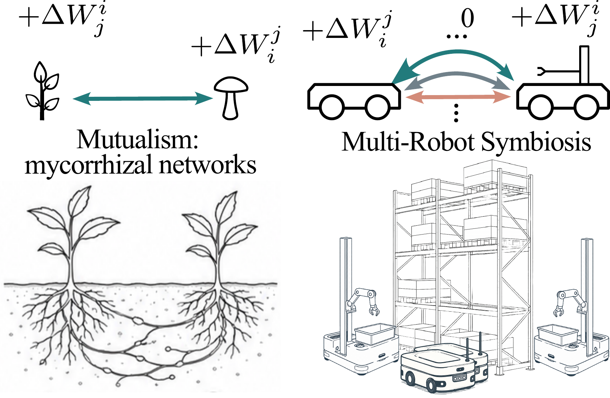
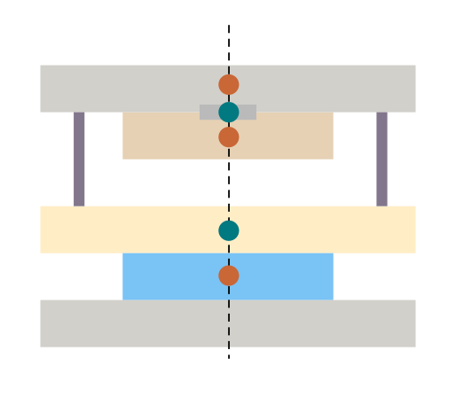
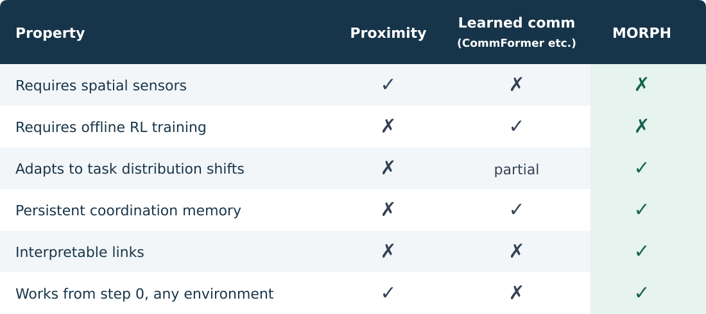
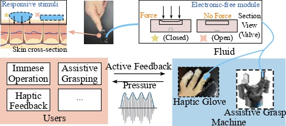
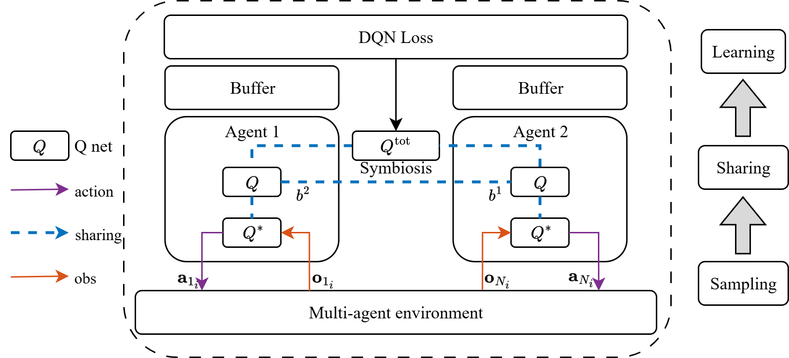

# Research
*(\*: equal contribution)*

**Please feel free to contact me if you are interested in any of the following works.**

### Manuscripts Under Review

  
  

    <h3>PRISM: Policy-shaping via Reward decomposition for Inter-agent Symbiosis in Multi-Robot Cooperation</h3>
    
<strong>Authors:</strong> <strong>Xuezhi Niu</strong> & <a href="https://didemgurdur.com/">Didem Gürdür Broo</a>

    
Under review at <em>The International Journal of Robotics Research (IJRR)</em>, 2026

    

      [Paper coming soon]
      <a href="https://github.com/Cyber-physical-Systems-Lab/PRISM_V2/tree/PRISM_V3">[Code]</a>
      <a href="https://cyber-physical-systems-lab.github.io/PRISM_V2/">[Website]</a>
      <a href="#" class="toggle" data-target="abs-prism">[Abstract]</a>
    

    

      

        
PRISM studies how heterogeneous robots can cooperate by accounting for their effects on one another’s task performance. Its reward-shaping framework represents inter-agent relationships through ecological concepts including mutualism, commensalism, parasitism, and competition. Rather than assigning an undifferentiated cooperation bonus, it uses these relationships to shape learning in teams with different capabilities and resource constraints. Experiments in battery-aware TA-RWARE warehouses pair automated guided vehicles with picker robots. Compared with flat-cooperative and task-only rewards, PRISM increases package-delivery throughput, improves handling of more demanding package types, and yields stronger indicators of mutualistic interaction.

      

    

  

### Journal Publications

  
  

    <h3>Miniaturized Multifunctional Valves for Intelligent Pneumatic Systems in Soft Robotics</h3>
    
<strong>Authors:</strong> <a href="https://linkedin.com/in/jing-xu-4161641ba">Jing Xu</a>, <strong>Xuezhi Niu</strong>, Jakob Andersson, <a href="https://didemgurdur.com/">Didem Gürdür Broo</a> & <a href="https://www.uu.se/kontakt-och-organisation/personal?query=XX3950">Klas Hjort</a>

    
Accepted to <em>Advanced Intelligent Systems</em>, 2 September 2026

    

      [Paper coming soon]
      <a href="#" class="toggle" data-target="abs-valves">[Abstract]</a>
      <a href="#" class="toggle" data-target="bib-valves">[BibTeX]</a>
    

    

      

        
Soft robotics stands to benefit significantly from advances in pneumatic circuit-based actuation, sensing, and on-board logic. Soft pneumatic valves serve as vital components; however, existing implementations remain limited by insufficient function versatility, constraining their use in intelligent pneumatic architectures. Here, we present a unified framework for miniaturized functional pneumatic valves that provides both normally open (NO) and normally closed (NC) configurations. These valves can execute logic operations (AND, OR, NAND, and NOR) and can be rapidly reconfigured and programmed without physical replumbing or hardware modification. Fast dynamic response is achieved, with time constants as low as 5.2 milliseconds and 6.1 milliseconds for NO and NC valves, respectively. These valves enable embodied intelligence, as demonstrated in two representative robotic systems. First, we realize a reflexive response by an electronics-free autonomous soft gripper capable of regulating grasping force. Second, we demonstrate a robotic gripper that integrates valve-based tactile sensing to classify objects and support higher-level intelligent control. Together, these results establish multifunctional pneumatic valves as foundational building blocks for intelligent pneumatic systems, enabling decentralized sensing, decision-making, and adaptive control through physical embodiment. This approach advances soft robotics toward autonomy by embedding intelligence directly into the material and fluidic architecture of the system.

      

      

        

          <button class="copy-bib" data-copy="#bib-text-valves" aria-label="Copy BibTeX">📋</button>
          <pre><code id="bib-text-valves">@article{xu2026miniaturized,
  title = {Miniaturized Multifunctional Valves for Intelligent Pneumatic Systems in Soft Robotics},
  author = {Xu, Jing and Niu, Xuezhi and Andersson, Jakob and Gürdür Broo, Didem and Hjort, Klas},
  journal = {Advanced Intelligent Systems},
  year = {2026},
  note = {Accepted for publication}
}</code></pre>
        

      

    

  

  
  

    <h3>Optimal gait design for a soft quadruped robot via multi-fidelity Bayesian optimization</h3>
    
<strong>Authors:</strong> <a href="https://kaigetan.github.io/">Kaige Tan</a>, <strong>Xuezhi Niu</strong>, <a href="https://qinglei.tech/">Qinglei Ji</a>, <a href="https://www.kth.se/profile/lfeng">Lei Feng</a> & <a href="https://www.kth.se/profile/martint">Martin Törngren</a>

    
<em>Applied Soft Computing</em>, 2025

    

      <a href="https://doi.org/10.1016/j.asoc.2024.112568">[Paper]</a>
      <a href="https://github.com/KaigeTan/MFBO_KTH">[Code]</a>
      <a href="#" class="toggle" data-target="abs-asoc">[Abstract]</a>
      <a href="#" class="toggle" data-target="bib-asoc">[BibTeX]</a>
    

    

			

        

          This study focuses on the locomotion capability improvement in a tendon-driven soft quadruped robot through an online adaptive learning approach. Leveraging the inverse kinematics model of the soft quadruped robot, we employ a central pattern generator to design a parametric gait pattern, and use Bayesian optimization (BO) to find the optimal parameters. Further, to address the challenges of modeling discrepancies, we implement a multi-fidelity BO approach, combining data from both simulation and physical experiments throughout training and optimization. This strategy enables the adaptive refinement of the gait pattern and ensures a smooth transition from simulation to real-world deployment for the controller. Compared to previous result using a fixed gait pattern, the multi-fidelity BO approach improves the robot’s average walking speed from 0.14 m/s to <strong>0.214 m/s</strong>, an increase of <strong>52.7%</strong>. Moreover, we integrate a computational task off-loading architecture by edge computing, which reduces the onboard computational and memory overhead, to improve real-time control performance and facilitate an effective online learning process. The proposed approach successfully achieves optimal walking gait design for physical deployment with high efficiency, effectively addressing challenges related to the reality gap in soft robotics.
        

      

      

        

            <button class="copy-bib" data-copy="#bib-text-asoc" aria-label="Copy BibTeX">📋</button>
            <pre><code id="bib-text-asoc">@article{TAN2025112568,
  title = {Optimal gait design for a soft quadruped robot via multi-fidelity Bayesian optimization},
  journal = {Applied Soft Computing},
  volume = {169},
  pages = {112568},
  year = {2025},
  issn = {1568-4946},
  doi = {https://doi.org/10.1016/j.asoc.2024.112568},
  url = {https://www.sciencedirect.com/science/article/pii/S1568494624013425},
  author = {Kaige Tan and Xuezhi Niu and Qinglei Ji and Lei Feng and Martin Törngren},
}</code></pre>
        

      

    

  

### Conference Publications

  
  

    <h3>MORPH: Self-Organising Multi-Robot Task Allocation via Neuroplasticity-Inspired Adaptive Topology</h3>
    
<strong>Authors:</strong> <strong>Xuezhi Niu</strong> & <a href="https://didemgurdur.com/">Didem Gürdür Broo</a>

    
Accepted to <em>EUMAS 2026</em>, 6 July 2026

    

      [Paper coming soon]
      <a href="https://github.com/Cyber-physical-Systems-Lab/morph_v2/tree/EUMAS">[Code]</a>
      <a href="#" class="toggle" data-target="abs-morph">[Abstract]</a>
      <a href="#" class="toggle" data-target="bib-morph">[BibTeX]</a>
    

    

      

        
Multi-robot task allocation (MRTA) in dynamic environments faces a fundamental tension: effective coordination requires learned structure, but that structure must adapt when conditions change. Existing methods resolve this by assuming prior task knowledge — a utility function, a cost matrix, or a trained policy making them brittle when deployed without such knowledge or when task distributions shift. We present MORPH (Multi-agent Online Rewiring through Plasticity-guided Hierarchy), a training-free MRTA framework in which global allocation quality emerges from four interacting local plasticity rules (synaptic, homeostatic, structural, and metaplasticity) applied to a directed pairwise preference matrix updated from runtime co-occurrence and task-completion feedback. MORPH requires no task model, no bid computation, and no offline training; response decisions use learned AGV-to-Picker preferences rather than a fixed proximity rule. Within the Gerkey–Mataric MRTA taxonomy, MORPH is the first method in the single-task, single-robot, instantaneous-assignment class to learn directed pairwise allocation preferences online. Evaluated on the TA-RWARE robotic warehouse benchmark (N = 8–24 agents, four map scales, T = 800 steps per episode, 5 seeds), MORPH achieves 110% of all-to-all throughput at N=24 while using only 21% of possible coordination links as an efficiency advantage that grows monotonically with fleet size. Under spatial task distribution shift, MORPH degrades 3× less than proximity-based methods while its learned preferences remain uncorrelated with Manhattan distance. Systematic ablation confirms all four plasticity rules contribute measurably. Two allocation properties emerge without programming: cross-type preference dominance and progressive preference sparsification, mirroring the developmental refinement of biological neural circuits. Learned preferences are driven by task co-occurrence history, not spatial proximity.

      

      

        

          <button class="copy-bib" data-copy="#bib-text-morph" aria-label="Copy BibTeX">📋</button>
          <pre><code id="bib-text-morph">@inproceedings{niu2026morph,
  title = {MORPH: Self-Organising Multi-Robot Task Allocation via Neuroplasticity-Inspired Adaptive Topology},
  author = {Niu, Xuezhi and Gürdür Broo, Didem},
  booktitle = {EUMAS 2026},
  year = {2026},
  note = {Accepted for publication}
}</code></pre>
        

      

    

  

  
  

    <h3>TouchDrive: Electronics-Free Tactile Sensing Interface for Assistive Grasping</h3>
    
<strong>Authors:</strong> <a href="https://linkedin.com/in/jing-xu-4161641ba">Jing Xu</a>, <strong>Xuezhi Niu </strong>, <a href="https://didemgurdur.com/">Didem Gürdür Broo</a> & <a href="https://www.uu.se/kontakt-och-organisation/personal?query=XX3950">Klas Hjort</a>

    
Presented at the <a href="https://www.robotac.eu/robotac-2026v2">RoboTac workshop</a>, <em>IEEE International Conference on Robotics and Automation (ICRA 2026)</em>, 5 June 2026

    

      <a href="https://doi.org/10.48550/arXiv.2605.06432">[Paper]</a>
      <a href="https://github.com/treebranch8600/TouchDrive">[Code]</a>
      <a href="#" class="toggle" data-target="abs-icra2026">[Abstract]</a>
      <!-- <a href="#" class="toggle" data-target="bib-icra2026">[BibTeX]</a> -->
    

    

			

        

          TouchDrive is an electronics-free tactile interface designed to help users control assistive robotic grasping. Contact forces operate a pneumatic valve, producing pressure signals and haptic feedback within a passive mechanical loop. A normally closed valve, compressed-air tank, sensing element, and feedback actuator provide the interface without electronic sensing or digital processing. The resulting tactile cues help users adjust grasp force when manipulating delicate or compliant objects. Experiments across several robotic platforms and up to 20 everyday objects demonstrate the interface’s practical use for assistive grasping.
        

      

    

  

  
  

    <h3>"What do I do now?": Spontaneous Human Responses to Robot Effectiveness and Efficiency Malfunctions in Collaborative Robotics</h3>
    
<strong>Authors:</strong> <a href="https://linkedin.com/in/alexandros-rouchitsas">Alexandros Rouchitsas</a>, <strong>Xuezhi Niu </strong>, Ginevra Castellano & <a href="https://didemgurdur.com/">Didem Gürdür Broo</a>

    
Accepted to <em>The ACM Conference on Human Factors in Computing Systems (CHI2026)</em>

    

      <a href="https://doi.org/10.1145/3772318.3793419">[Paper]</a>
      <!-- <a href="https://github.com/Cyber-physical-Systems-Lab/RewMARL">[Code]</a> -->
      <a href="#" class="toggle" data-target="abs-chi">[Abstract]</a>
      <a href="#" class="toggle" data-target="bib-chi">[BibTeX]</a>
    

    

      

        

          <button class="copy-bib" data-copy="#bib-text-chi" aria-label="Copy BibTeX">📋</button>
          <pre><code id="bib-text-chi">@inproceedings{rouchitsas2026what,
  title = {“What do I do now?”: Spontaneous Human Responses to Robot Effectiveness and Efficiency Malfunctions in Collaborative Robotics},
  author = {Rouchitsas, Alexandros and Niu, Xuezhi and Castellano, Ginevra and Gürdür Broo, Didem},
  booktitle = {Proceedings of the 2026 CHI Conference on Human Factors in Computing Systems},
  series = {CHI &#x27;26},
  publisher = {ACM},
  year = {2026},
  month = apr,
  pages = {1--17},
  doi = {10.1145/3772318.3793419},
  url = {https://doi.org/10.1145/3772318.3793419}
}</code></pre>
        

      

			

        

          Robot malfunctions are unavoidable in human–robot collaboration and oftentimes detrimental. Yet humans are rarely instructed on how to respond in such moments, leaving ample room for spontaneity and unpredictability. We studied 65 participants working alongside a collaborative robot under both normal operation and deliberate malfunction conditions. We analyzed unscripted vocal and action responses regarding situational awareness (SA)—whether malfunctions were noticed—and task-oriented response appropriateness—whether responses advanced or undermined the collaboration. During malfunctions, SA was nearly universal, as was frustration and confusion, yet appropriateness diverged sharply: 22 participants responded only productively, 7 only unproductively or counterproductively, 15 did both, while 20 attempted nothing whatsoever. Unscripted responses ranged from clarifying questions and corrective actions to sarcasm, comedic gestures, and erroneous markings. Our findings reveal a fragile link between SA and collaboration quality, highlighting the need for robot transparency, explainability and adaptability, so collaborators are actively supported when things fail.
        

      

    

  

  
  

    <h3>Investigating Symbiosis in Robotic Ecosystems: A Case Study for Multi-Robot Reinforcement Learning Reward Shaping</h3>
    
<strong>Authors: Xuezhi Niu </strong> & <a href="https://didemgurdur.com/">Didem Gürdür Broo</a>

    
<em>2025 9th International Conference on Robotics and Automation Sciences (ICRAS)</em>

    

      <a href="https://doi.org/10.1109/ICRAS65818.2025.11108729">[Paper]</a>
      <a href="https://github.com/Cyber-physical-Systems-Lab/RewMARL">[Code]</a>
      <a href="#" class="toggle" data-target="abs-icras">[Abstract]</a>
      <a href="#" class="toggle" data-target="bib-icras">[BibTeX]</a>
    

    

			

        

          This paper presents a bio-inspired reward shaping approach for multi-agent reinforcement learning (MARL) in heterogeneous multi-robot systems, leveraging a formal symbiosis model to enhance cooperation. We categorize interactions based on mutualism, commensalism, and parasitism, introducing constructs such as graph models, state transition systems, and resource flow models to characterize inter-agent dependencies. By incorporating a taxonomy of symbiotic relationships into MARL, we define reward structures that reinforce cooperative behavior in complex tasks. Our experimental results demonstrate that while traditional rewards suffice for simple tasks like CartPendulum, mutualistic rewards provide qualitative benefits in high-dimensional tasks such as ShadowHand Object Passing and Mobile Manipulation, including increased learning stability, smoother convergence, and reduced performance variance. These findings suggest that symbiotic reward shaping provides a structured mechanism for enhancing multi-robot cooperation, with benefits that extend beyond numerical performance metrics. Future work should explore adaptive interaction mechanisms and generalization across diverse robotic applications.
        

      

      

        

            <button class="copy-bib" data-copy="#bib-text-icras" aria-label="Copy BibTeX">📋</button>
            <pre><code id="bib-text-icras">@INPROCEEDINGS{11108729,
  author={Niu, Xuezhi and Broo, Didem Gürdür},
  booktitle={2025 9th International Conference on Robotics and Automation Sciences (ICRAS)}, 
  title={Investigating Symbiosis in Robotic Ecosystems: A Case Study for Multi-Robot Reinforcement Learning Reward Shaping}, 
  year={2025},
  pages={112-117},
  doi={10.1109/ICRAS65818.2025.11108729}
}</code></pre>
        

      

    

  

  
  

    <h3>Enabling Symbiosis in Multi-Robot Systems through Multi-Agent Reinforcement Learning</h3>
    
<strong>Authors: Xuezhi Niu</strong>, <a href="https://linkedin.com/in/natycalvob">Natalia Calvo Barajas</a> & <a href="https://didemgurdur.com/">Didem Gürdür Broo</a>

    
<em>2025 IEEE 8th International Conference on Industrial Cyber-Physical Systems (ICPS)</em>

    

      <a href="https://doi.org/10.1109/ICPS65515.2025.11087893">[Paper]</a>
      <!-- <a href="https://file.notion.so/f/f/5545e1f6-49ca-45ca-b96d-957713429775/51f981db-9e0a-402b-ae08-2314a84f12b7/ICPS.pdf?table=block&id=24cff393-81aa-80dc-848a-ff435141c55d&spaceId=5545e1f6-49ca-45ca-b96d-957713429775&expirationTimestamp=1755540000000&signature=yOne_zcBiqppKVPdnj_dP1wxnOnG-oeT3kPHgNMmM9I&downloadName=ICPS.pdf">[Slides]</a> -->
      <a href="#" class="toggle" data-target="abs-icps2025">[Abstract]</a>
      <a href="#" class="toggle" data-target="bib-icps2025">[BibTeX]</a>
    

    

			

        

          Current cyber-physical systems, including multi-robot systems, often fail to interoperate effectively, resulting in suboptimal performance, inefficient resource utilization, and poor resilience. Inspired by natural symbiotic relationships, such as tree-fungi networks, we propose an architecture that integrates ecological symbiosis principles into multi-robot system specifications. Specifically, we incorporate symbiotic principles into multiagent reinforcement learning (MARL) within a centralized training, decentralized execution framework. Comprehensive scenario-based evaluations in a simulated warehouse environment show that our symbiotic MARL framework improves system performance (<strong>10.7%</strong>) and resource utilization (<strong>13.81%</strong>) compared to non-symbiotic baselines. Agents dynamically adjust their behavior in response to environmental changes, ensuring continuous task execution, efficient navigation, and balanced energy use. These findings demonstrate that integrating ecological principles into MARL enhances the system's efficiency and performance. The framework's success in promoting sustainable resource usage while maintaining high task performance suggests broader applications across various cyber-physical domains where adaptive coordination is crucial.
        

      

      

        

            <button class="copy-bib" data-copy="#bib-text-icps2025" aria-label="Copy BibTeX">📋</button>
            <pre><code id="bib-text-icps2025">@INPROCEEDINGS{niu2025enabling,
  author={Niu, Xuezhi and Barajas, Natalia Calvo and Broo, Didem Gürdür},
  booktitle={2025 IEEE 8th International Conference on Industrial Cyber-Physical Systems (ICPS)}, 
  title={Enabling Symbiosis in Multi-Robot Systems Through Multi-Agent Reinforcement Learning}, 
  year={2025},
  pages={1-7},
  doi={10.1109/ICPS65515.2025.11087893}
}</code></pre>
        

      

    

  

  
  

    <h3>Optimal Gait Control for a Tendon-driven Soft Quadruped Robot by Model-based Reinforcement Learning</h3>
    
<strong>Authors: Xuezhi Niu*</strong>, <a href="https://kaigetan.github.io/">Kaige Tan</a>*, <a href="https://didemgurdur.com/">Didem Gürdür Broo</a> & <a href="https://www.kth.se/profile/lfeng">Lei Feng</a>

    
<em>2025 IEEE International Conference on Robotics and Automation (ICRA)</em>

    

      <a href="https://doi.org/10.1109/ICRA55743.2025.11128611">[PDF]</a>
      <a href="https://github.com/n7729697/KTH-MasterThesis">[Code]</a>
      <a href="#" class="toggle" data-target="abs-softq">[Abstract]</a>
      <a href="#" class="toggle" data-target="bib-softq">[BibTeX]</a>
    

    

			

        

          This study presents an innovative approach to optimal gait control for a soft quadruped robot enabled by four compressible tendon-driven soft actuators. Soft quadruped robots, compared to their rigid counterparts, are widely recognized for offering enhanced safety, lower weight, and simpler fabrication and control mechanisms. However, their highly deformable structure introduces nonlinear dynamics, making precise gait locomotion control complex. To solve this problem, we propose a novel model-based reinforcement learning (MBRL) method. The study employs a multi-stage approach, including state space restriction, data-driven surrogate model training, and MBRL development. Compared to benchmark methods, the proposed approach significantly improves the efficiency and performance of gait control policies. The developed policy is both robust and adaptable to the robot's deformable morphology. The study concludes by highlighting the practical applicability of these findings in real-world scenarios.
        

      

      

        

            <button class="copy-bib" data-copy="#bib-text-softq" aria-label="Copy BibTeX">📋</button>
            <pre><code id="bib-text-softq">@inproceedings{niu2025optimal,
	title     = {Optimal Gait Control for a Tendon-driven Soft Quadruped Robot by Model-based Reinforcement Learning},
	author    = {Niu, Xuezhi and Tan, Kaige and G{\"u}rd{\"u}r Broo, Didem and Feng, Lei},
	booktitle = {2025 IEEE International Conference on Robotics and Automation (ICRA)}, 
	year      = {2025},
  pages     = {9287-9293},
	doi       = {10.1109/ICRA55743.2025.11128611},
	url       = {https://doi.org/10.1109/ICRA55743.2025.11128611}
}</code></pre>
        

      

    

  

### Thesis
* [Optimal Gait Control of Soft Quadruped Robot by Model-based Reinforcement Learning](https://urn.kb.se/resolve?urn=urn:nbn:se:kth:diva-339056) 
**Xuezhi Niu** 
*M.Sc. Thesis, KTH Royal Institute of Technology, Stockholm, Sweden,* 2023 

### Technical Report
* [Electronically Vacuum Regulated Shut-off Valve for Milking System](https://urn.kb.se/resolve?urn=urn:nbn:se:kth:diva-324226) 
Carl Egenäs\*, Felix Ekman\*, Chenqi Ma\*, Tim Naser\*, **Xuezhi Niu\***, Axel Sernelin\*, Samuel Stenow\*, Benjamin StrÖm\*  
*H.K. Project, KTH Royal Institute of Technology, Stockholm, Sweden,* 2023 

### Reviewer

| Venue | Years |
| :--- | :--- |
| IEEE International Conference on Robotics and Automation (ICRA) | 2025, 2026 |
| IEEE/ASME International Conference on Advanced Intelligent Mechatronics (AIM) | 2024 |
| IEEE International Conference on Industrial Cyber-Physical Systems (ICPS) | 2025 |
| IEEE-RAS International Conference on Humanoid Robots (Humanoids) | 2024 |
| IEEE International Conference on Robot and Human Interactive Communication (RO-MAN) | 2025 |
| Journal of Field Robotics (JFR) | 2026 |

<!-- Modal (hidden by default) -->

  <button class="lb-close" aria-label="Close">×</button>
  
  

